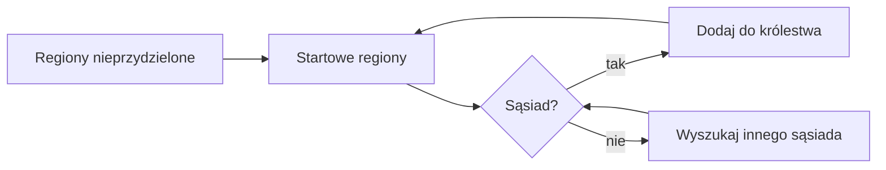
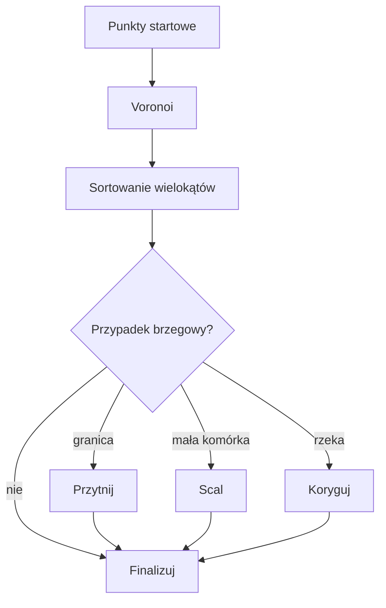

Game Design & Loops

Temat:
- Handel i logistyka na grafie wektorowym (węzły i krawędzie).

For map behaviour and generation specifics, see `/docs/map` — the single source of truth.

## Konfiguracja Królestw
- Liczba królestw, kolory i miasta startowe definiują układ polityczny mapy.
- Regiony są przydzielane kolejno tak, by każde królestwo zachowało ciągłość terytorialną.
- Parametry konfiguracji są ustawiane przed generacją mapy.

## Ciągłość Regionów
Podczas przydziału nowych regionów algorytm wybiera tylko pola sąsiadujące
z już posiadanymi.

## Przebieg Generacji Regionów
1. Losowe punkty startowe tworzą diagram Voronoi.
2. Powstałe komórki zamieniane są na wielokąty i sortowane po powierzchni.
3. Obsługiwane są przypadki brzegowe: granice mapy, małe komórki, przebiegi rzek.

## Pętla Rozgrywki
- Wybór trybu (Single/Host/Join).
- Przydział regionów do królestw.
- Eksploracja mapy.
- Log zdarzeń.

## Implementacja
- Specyfikacja i zachowanie mapy: `/docs/map`.
- Implementacja referencyjna: [MapGenerator.gd](../../game/mapgen/MapGenerator.gd).
- Przydział i kształt regionów: [RegionGenerator.gd](../../game/mapgen/RegionGenerator.gd).

## Rozszerzenia
- Wyznaczanie tras, czasy przejazdu, blokady mostów, proste cele dostawy A→B.

## UI — high‑level
- Ekran mapy: pełnoekranowa mapa, panel boczny z filtrami, pasek statusu (rola/region/seed/latency), log zdarzeń.
- Debug UI: peery, regiony, komendy, timeline snapshot/diff.
